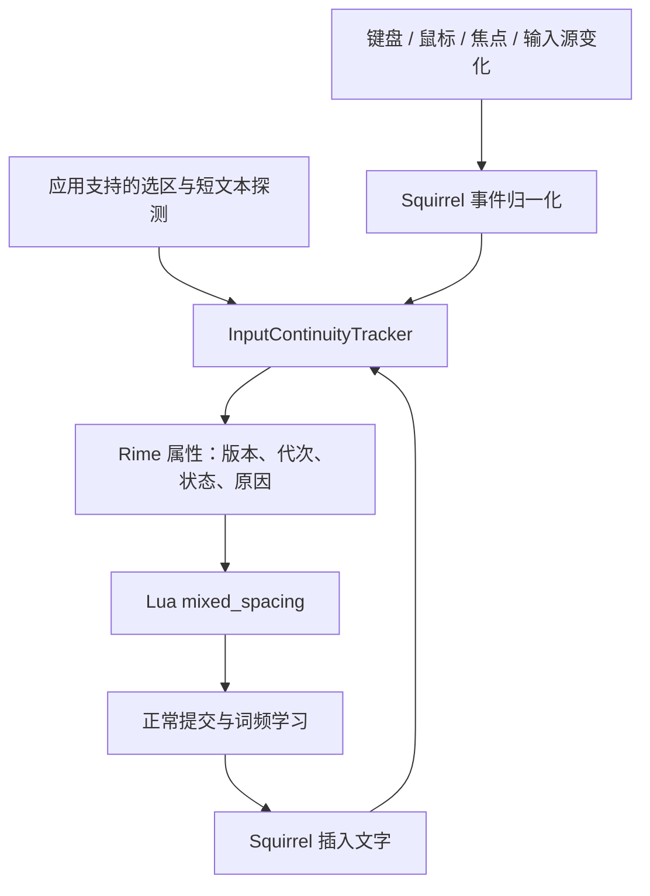

> Approved design reference from 2026-09-11. Current implementation and verification status are in README.md and IMPLEMENTATION.md.

# 鼠须管中英文自动空格：编辑上下文感知方案

日期：2026-09-11。状态：设计稿，尚未创建 GitHub fork、修改客户端或安装新版本。

目标应用暂按原生文本编辑器、浏览器、VS Code、聊天应用和终端设计，具体应用优先级可以调整。

## 1. 目标与范围

连续输入时，前一段以汉字结尾、后一段以 ASCII 英文字母开头，或反过来，在两段之间补一个 U+0020 空格。已有空白、标点、换行不重复补。选词、用户词频和自动造词保持正常。

关键约束：只有在“仍在同一编辑位置连续输入”的证据有效时，才允许沿用上一段的语言类别。明确发生编辑位置变化就断开连续性；无法可靠判断时跳过本次自动空格。

第一版只处理连续提交的边界，不重排整段文字，不修改同一候选词内部，不扫描历史段落，不把数字自动归类成英文，不跨输入法恢复原有边界。密码输入和未验证的特殊输入控件不启用增强模式。

## 2. 已核实的现状

- 本机为 Squirrel 1.1.2、librime 1.16.0，已部署 `config/lua/mixed_spacing.lua`。
- 现有 22 个 C API 用例证明了引擎收到按键后的行为，不证明系统事件已正确送达客户端。
- Squirrel 1.1.2 的 `recognizedEvents` 只包含 keyDown 和 flagsChanged；Command 组合键在 `handle` 中直接放行。
- `activateServer` / `deactivateServer` 是现有生命周期入口；`commitComposition` 可以直接调用客户端插入文本，绕过普通 Rime 提交回调。
- 自绘候选窗口已有自己的鼠标选择、翻页和组词光标处理，不能与编辑器鼠标点击一律处理。
- librime 已有 `set_property`，librime-lua 暴露 `property_update_notifier`，可承载客户端到 Lua 的小型通知，不必先修改引擎。
- Apple SDK 的 IMKInputSession.h 明确指出：文档选区和文本读取依赖应用支持，可能返回 nil / NSNotFound。应用 ID、输入控制器对象或光标坐标都不能单独作为“同一文档同一位置”的证明。

源码参考基线：稳定标签 1.1.2（876adebaf2f612951dcdca8a591de65401222b9a）；对照上游 master 快照 0cd71a6130a5866b0ae6ba0494929ebdc8211194。实现首先以已安装版本为基线，确认构建可用后再挑选必要的上游修复，避免将 master 行为当成本机现状。

## 3. 方案选择

| 方案 | 能力与代价 | 结论 |
| --- | --- | --- |
| 仅增强 Lua | 可处理收到的按键，不能补齐客户端遗漏的系统事件 | 保留为兼容模式 |
| 小范围 Squirrel fork + Lua | 客户端检测连续性，Lua 保留排版规则；无需改词库和引擎核心 | 推荐 |
| 全部排版迁入客户端，或增加全局辅助程序 | 可统一更多直接提交路径，但改动面、运行组件和兼容成本更大 | 暂不采用 |

客户端只发布“当前连续输入上下文是否有效”，不要求它识别中文和英文。Lua 只在有效上下文中补空格，不用历史上屏文本猜测文档位置。

## 4. 架构与文件边界



计划新增 `sources/InputContinuityTracker.swift`：纯状态机，不直接依赖编辑器，方便测试。

计划新增 `sources/InputContextProbe.swift`：封装 IMKTextInput 能力探测和短范围读取，处理失败、过期快照和应用差异。

在 `SquirrelInputController.swift` 接入按键前后、会话创建销毁、激活失活、候选点击和真实提交路径；在 `SquirrelApplicationDelegate.swift` 管理输入源/应用切换和可选鼠标监听生命周期。候选窗口只补充事件归属标记，尽量不改变原有选择逻辑。

扩展 `config/lua/mixed_spacing.lua`，新增上下文通知和开关处理。增强模式中，系统连续性由客户端负责；Lua 不再把每个修饰键按下都无差别视为重置，否则 Cmd+C 等操作无法保留状态。

## 5. 状态机与通知协议

每个输入会话独立保存：session generation、focus generation、context epoch、状态、当前组合事务、最近一次可信插入锚点。不存在跨应用共享的 last-language。

状态分为：

- `suspended`：输入法未激活、客户端失效或功能关闭，不补空格，也不建立新边界。
- `empty`：可以开始新的输入，但没有上一段边界；下一次可信提交原样输出，再建立记录。
- `tracking`：已有可信边界，允许判断中英交界。
- `uncertain`：快照或事件来源不可靠；跳过空格，待新的受控输入与有效快照建立锚点后才恢复。严格模式下，应用始终不给有效快照就始终不自动补。

任何确定的位置/外部内容变化使 epoch 加一，并清除 Lua 的 `last`。语义相同的重复事件可以合并，但不可因合并漏掉切换回原应用的状态变化。

客户端通过单个属性 `squirrel_spacing_context` 发布紧凑 JSON，例如：

```json
{"v":1,"session":"s7","epoch":18,"state":"empty","reason":"pointer"}
```

属性名、JSON 和配置键均为拟新增协议，并非官方现成功能。所有字段原子更新；原因仅用于诊断。实现时用正式 JSON 编解码，避免字符串拼接。桥接层在会话存在时才调用 `set_property`；Lua 在 init 时读取当前值，并订阅后续变化；fini 断开连接。新会话、更高 epoch、suspended/uncertain 均清空旧边界；忽略旧会话或旧 epoch 的延迟消息。

增强模式要求协议握手。若版本不兼容、属性缺失或解析失败，则停用增强空格，不悄悄回退到有陈旧状态风险的行为。用户可以显式选择旧版兼容模式。

`last` 只在确定的文本输出后作为可复用状态保存，空白或标点令其变为空。Lua 提交前回调内的边界更新只能是当前事务的暂存值；客户端需在消费提交后确认该事务仍属于同一 generation/epoch。失败、目标改变或快照不符合预期时，丢弃暂存值并重置；不能把调用 insertText 返回直接等同于应用已按预期插入。获得新的定位快照不等于恢复旧 `last`。连续输入链一旦断开，即使光标后来回到原处，也从空边界开始。

## 6. 事件策略

| 事件 | 处理方式 |
| --- | --- |
| 编辑区左/右/其他鼠标按下，拖动选择开始 | 在后续提交前使连续性失效；拖动期间保持失效，结束后重新取样 |
| 点击候选、候选翻页、移动拼音内部光标 | 保留同一组合事务，不作为外部编辑；按窗口和动作身份识别，不能仅靠屏幕矩形 |
| 普通鼠标移动、滚动 | 不直接清空；若随后发现选区变化，再清空 |
| 失焦、应用切换、输入源切走、会话销毁 | 先 suspended，再执行原有收尾；收尾产生的提交不能重新激活边界 |
| 激活、切回输入源、新输入目标 | 新 generation，进入 empty 或 uncertain；不能恢复旧语言状态 |
| Return / Enter / Shift+Return / Tab | 结合组合状态和事件是否被 Rime 消费判断；送往应用的换行/Tab 清空；只提交候选或原始英文则仍属于当前事务 |
| Backspace / Delete / 导航 / 扩展选区 | 修改应用文本或应用选区时清空；仅编辑当前拼音、候选菜单时保留 |
| Cmd+V/X/Z、重做、全选、查找跳转等 | 在 Command 分支放行前失效；不消费、不伪造快捷键；具体组合还需按布局与应用核验 |
| Cmd+C / 普通保存 | 在已验证映射且快照未变时保留；未知自定义快捷键按不确定处理 |
| 单独 Shift 中英切换 | 保留；跨系统输入源切换则重置 |
| 通过菜单粘贴、代码片段、自动纠错、外部改写 | 由位置/短上下文探测补充检测；无法观察的应用不宣称完整覆盖 |
| 锁屏、睡眠恢复、客户端连接失效 | suspended / 新 generation，重新建立输入链 |
| 重新部署、方案切换、功能开关改变 | 初始化为空，重新握手 |

不能只在 Lua 中重置 Command：本机客户端可能不把实际快捷键传入引擎。也不能根据“按了某个键”一律重置：例如数字选词与数字直输、回车上屏与换行、Backspace 改拼音与删除正文必须区分。

## 7. 鼠标与焦点的捕获

先验证 InputMethodKit 订阅鼠标事件在目标应用中的覆盖，不把 `recognizedEvents` 增加一个 mask 当作完成。

若覆盖不足，在鼠须管内部增加仅观察鼠标的 NSEvent 全局监视器，接收其他进程的点击；本进程事件走现有候选窗口路径，必要时增加局部监听。全局/局部监听范围不同，且全局监听不能阻止事件。不开全局键盘监听，不合成 Esc/Backspace，不读取剪贴板。

监听器在客户端有效时只使当前会话失效；所有 Rime 调用回到主线程。鼠标观察不能保证跨进程事件到达顺序，所以在真正处理下一次输入前仍需进行快照核验，不能承诺监听器本身消除所有竞态。候选点击去重和归属必须在真实客户端测试。

焦点通过 IMK 生命周期、输入源变化和前台应用变化组合判断。输入法进程自身的 NSApplication 活跃状态不能替代目标应用的焦点；同一应用中的两个输入框也不能只用 bundle ID 区分。无法取得可靠文档/控件身份时，靠激活代次与选区证据作保守判断。

## 8. 位置核验与组合事务

在应用确实支持时读取文档选区、标记范围和插入锚点左侧最多 32 个 UTF-16 单元的短文本。读取只用于本地比较，退出焦点或重置即丢弃；不记录实际正文。处理 NSNotFound、nil、范围越界、代理对截断和中文扩展字符；不把 UTF-8 字节数当成 NSRange 的长度。

核验时机：新组合开始前、实际提交前、英文直通事件前；提交后用有效返回值建立新锚点。已有标记文本时比较组合的锚点和已知替换范围，不能把拼音长度改变造成的选区变化认作外部编辑。Squirrel 自身的 marked-text 更新和 insertText 应标记为内部事务。

英文直通按键被放行时，应用可能尚未完成插入。记录 pending 状态和期望字符，只在下一次观察确认后建立新锚点；不能拿按键处理函数返回时的旧选区当成最终位置。若应用自动替换或选区不同于预期，转为 empty/uncertain。

只比较选区不够：原地替换可能保持长度不变，所以加入短上下文比对。短快照也不是完整文档版本，无法保证发现所有程序化修改、变化后又恢复原状等情况；功能边界必须明确。

IMK 查询可能跨进程且同步。第一阶段先测量其开销，热路径不轮询、不读取整篇文档；对慢或不稳定的应用禁用增强探测。不能宣称设置一个异步超时就能取消已经阻塞的 IMK 调用。

## 9. 提交顺序与现有 Lua 的改造

正常候选路径保持现有 Rime 提交和学习链，Lua 仍在提交前检查真实首字符，最多补一次空格。客户端 reset 只清除排版状态，绝不借助清空用户词典或模拟删除来实现。

按键顺序：核验目标与快照 → 必要时同步发布失效 → 交给原有按键逻辑 → 消费正常提交 → 更新锚点/直通 pending。

候选窗口点击没有普通 keyDown，因此候选选择入口也必须做核验。失焦顺序为：suspended → 原有 composition 收尾 → 清理 client；收尾无论走哪条插入路径，均不得给新输入框留下可复用边界。

必须审计 `commitComposition` 直接插入、其他 Lua 的 `engine:commit_text`、英文直通这三类旁路。第一版保证标准候选、回车原始英文、Shift 切换和直通英文；未接入排版前置检查的自定义直接提交路径原样提交并使边界失效，不能把它们算成已支持。必要的真实出口更新钩子只负责确认/失效，不再第二次添加空格，避免客户端与 Lua 双重排版。

现有脚本需要修正的内容包括：接入会话协议、停止仅凭 Ctrl/Alt/Command 修饰键无条件重置、增强模式下不把 Tab/Esc/Shift+Return 的所有组词用法一律看成外部编辑，以及覆盖直接提交/焦点收尾的旧状态问题。兼容模式保留独立的保守按键规则。

## 10. 应用配置与降级

拟新增配置示意，不可直接用于当前官方版本：

```yaml
patch:
  spacing_context/enabled: true
  spacing_context/mode: verified
  spacing_context/unknown_client: disable
  spacing_context/debug: false
```

模式：`verified` 需要有效定位证据；`events_only` 只依赖可见事件，作为用户主动选择的兼容模式，不能声称覆盖外部编辑；`off` 关闭。应用覆盖配置在实现时单独设计解析，不能直接塞进现有只承载 Rime 布尔开关的 app_options。

先用原生 NSTextView 验证基本能力，再验证 Chrome/Safari、VS Code、用户常用聊天应用。终端/远程桌面默认不启用增强空格，除非针对具体输入场景验证通过并显式启用；不能仅因应用可输入中文就视为上下文接口可靠。浏览器里也需分别测试普通 textarea 与 contenteditable。

诊断仅输出事件类别、epoch、状态和能力结果，默认关闭，不打印实际按键字符、输入正文或剪贴板。若未来发现必须使用辅助功能权限才能覆盖目标控件，再作为独立可选方案评估；本方案第一版不依赖 AX 全局文本读取。

## 11. 验证与验收

三层证据缺一不可：

1. Swift 状态机测试：两会话隔离、重复/延迟事件、focus 收尾、同位置返回、内部 composition 变化、直通插入滞后、快照失败和慢客户端降级。
2. librime 集成测试：扩展现有 22 个用例，加入属性握手/版本不符、连续多次 reset、suspended 中提交、重建会话、回调断连；确认学习记录没有前导空格污染、重启后仍存在。
3. 真实客户端端到端测试：受控 NSTextView 测试宿主 + 真实应用矩阵；实际切换输入源、点击输入框、输入与读取结果。C API 测试不能替代此层。

必须覆盖的结果：

| 操作 | 预期 |
| --- | --- |
| 输入 hello，再选中文 | hello 中文 |
| 输入中文，Shift 切英文并输入 hello | 中文 hello |
| 输入 hello，换行，再选中文 | 新行以中文开头，无前导空格 |
| 输入中文，点空输入框，输入 hello | 新输入框以 hello 开头 |
| 输入中文，点同一框另一个位置，再输入 hello | 不沿用旧中文边界补空格 |
| 输入 hello，鼠标选“中文”候选 | hello 中文，只有一个空格 |
| 快速点输入框并立即打字 / 拖选后输入 | 不把旧边界带入新位置；记录事件顺序 |
| Cmd+V 与菜单粘贴、剪切、撤销/重做 | 不依据旧边界补空格 |
| 英文直通后应用自动改写，再输入中文 | 不信任旧的英文提交位置 |
| 改拼音、翻候选、复制 | 在上下文确实未变时保持正常边界行为 |
| 不支持文档查询 / 密码框 / 禁用应用 | 正常输入不受影响，跳过增强空格 |
| 输入后切源再切回、锁屏恢复、部署 | 新的连续输入链 |

另测 Emoji、代理对、组合音标、文档开头、替换选区、长句、内联显示不同模式、输入过程中失焦、原始提交旁路、卸载监听器以及升级回退。检查正文、候选、用户词库、撤销行为，不能只看日志。

性能验收：同机对照官方版本记录输入延迟 p50/p95/p99 和快照调用耗时；状态机和桥接自身不引入可感知停顿。若某应用查询造成明显延迟，关闭该应用的增强探测。具体阈值在能力验证阶段根据基线设定，不提前宣称性能已达标。

## 12. 实施阶段与交付

P0 能力验证：基于 1.1.2 建立可复现构建，制作事件/选区探测原型和原生测试宿主。交付应用能力表，确认鼠标、焦点、标记范围和直接提交路径实际行为。若关键应用缺乏证据，明确降级方式。

P1 基础桥接：独立状态机、版本化属性、焦点/输入源/Command 处理、Lua 接入与配置关闭开关。通过状态机和 librime 测试后，在测试宿主验证。

P2 鼠标与定位：补齐鼠标归属、候选点击保护、组合事务锚点和短上下文核验，逐个通过应用矩阵。

P3 日常试用：先启用已通过验证的应用，保留诊断开关与一键停用；积累真实输入回归样例，再扩展范围。完成之后才称为完整增强版；P1 不标为最终交付。

交付包括：小范围 fork、客户端补丁与测试、Lua 配置、固定依赖的构建脚本、本机构建产物、能力矩阵、升级和回退说明。这里没有预先承诺开发工期，最大不确定性在应用事件/文档接口兼容性。

## 13. Fork 与升级维护

以官方稳定版本建立跟踪分支，把事件桥接、状态机和应用策略拆成少量独立提交。先不改 librime 和词库；更新官方时先合并到验证分支，再运行三层回归。

开发构建使用独立标识、名称和独立用户数据目录，避免与正在使用的鼠须管共享 LevelDB。初次测试从备份复制数据；两个进程不能同时打开同一用户词库。

自用先验证本地签名构建的系统注册与加载流程；对外分发再按官方构建说明配置 Developer ID 签名/公证，不把自用测试描述为必须有付费证书。开发版本禁用指向官方包的自动替换更新，防止补丁被覆盖。

回退分两层：功能问题先把增强模式关闭；客户端问题切回官方输入源。保留官方安装包、独立备份和新学词的导出路径，回退不得覆盖或删除用户当前学习数据。

## 14. 参考资料

- [Squirrel 1.1.2 输入控制器](https://github.com/rime/squirrel/blob/1.1.2/sources/SquirrelInputController.swift)
- [上游输入控制器快照](https://github.com/rime/squirrel/blob/0cd71a6130a5866b0ae6ba0494929ebdc8211194/sources/SquirrelInputController.swift)
- [候选窗口鼠标处理](https://github.com/rime/squirrel/blob/0cd71a6130a5866b0ae6ba0494929ebdc8211194/sources/SquirrelPanel.swift)
- [Apple：局部与全局事件监视](https://developer.apple.com/library/archive/documentation/Cocoa/Conceptual/EventOverview/MonitoringEvents/MonitoringEvents.html)
- [librime Context 属性通知](https://github.com/rime/librime/blob/master/src/rime/context.cc)
- [librime-lua 类型绑定](https://github.com/hchunhui/librime-lua/blob/master/src/types.cc)
- [Squirrel 构建与安装](https://github.com/rime/squirrel/blob/master/INSTALL.md)
- 本机 Xcode SDK：`Carbon.framework/Frameworks/HIToolbox.framework/Headers/IMKInputSession.h`，文档选区和短文本访问的能力限制。
